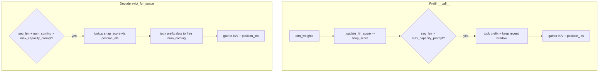

# Align SnapKVCache.evict_for_space with __call__

## Problem

[`SnapKVCache.evict_for_space`](c:\Users\patel\Downloads\SnapKVCacheLLMPaperImplementation\modify_qwen.py) (lines 195–297) is still **H2O copy-paste**:

- Uses `self.hh_score`, `self.cache_size`, `self.recent_size`, `self.hh_size` (undefined on `SnapKVCache`)
- Gathers `hh_score` after eviction (not needed for SnapKV)

[`SnapKVCache.__call__`](c:\Users\patel\Downloads\SnapKVCacheLLMPaperImplementation\modify_qwen.py) (lines 147–193) uses different semantics:

- Budget: `max_capacity_prompt`
- Recent window: `window_size`
- Prefix ranking: `snap_score` + `topk(max_capacity_prompt - window_size)`
- No score gather after compression



## Target behavior

| Concept | `__call__` (prefill) | `evict_for_space` (decode) |
|---------|----------------------|----------------------------|
| Eviction trigger | `seq_len > max_capacity_prompt` | `seq_len + num_coming > max_capacity_prompt` |
| Final cache size | `max_capacity_prompt` | `max_capacity_prompt - num_coming` (room before append) |
| Prefix keep count | `max_capacity_prompt - window_size` | `max_capacity_prompt - window_size - num_coming` |
| Recent keep | last `window_size` physical slots | last `window_size` physical slots |
| Score source | `snap_score` directly (prefix columns) | `snap_score` indexed by `position_ids` for prefix slots |
| After gather | `position_ids` only | `position_ids` only (no `snap_score` gather) |

## Implementation plan

### 1. Fix `SnapKVCache` prerequisites (same class, small fixes)

In [`modify_qwen.py`](c:\Users\patel\Downloads\SnapKVCacheLLMPaperImplementation\modify_qwen.py) `SnapKVCache.__init__`:

- Add `self.snap_score = None`
- Remove unused `self.hh_score = None` (or stop referencing it)

Fix bugs that break both paths:

- **`__call__` line 181:** `self.max_window_capacity` → `self.max_capacity_prompt`
- **`_append_positions` line 89:** `n_heads = self.num_key_value_heads` (not `self.hh_score.shape[1]`)
- **`_mask_hh_scores_with_valid_positions` line 140:** replace `self.hh_size` warning threshold with `max_capacity_prompt - window_size` (or drop warning)

### 2. Add helper: `_lookup_prefix_scores(prefix_len)`

New private method on `SnapKVCache`:

- **Input:** `prefix_len = seq_len - window_size`
- **Requires:** `self.snap_score` `[B, kv_heads, snap_width]` and `self.position_ids` `[B, kv_heads, seq_len]`
- **Output:** `[B, kv_heads, prefix_len]` where entry `[b,h,p]` is:
  - `snap_score[b, h, position_ids[b,h,p]]` if `position_ids[b,h,p] < snap_score.shape[-1]`
  - else `finfo.min` (generated / out-of-prefill-score range slots should not win topk)

This implements your chosen **snap_score + position_ids lookup** for decode.

### 3. Extract shared eviction core: `_gather_compressed_cache(...)`

Factor the duplicated gather block from `__call__` (lines 179–193) into one method:

```python
def _gather_compressed_cache(
    self, keys, values, select_scores, num_prefix_keep,
    padding_attention_mask=None, past_key_values=None,
):
```

Shared steps:

1. Optionally mask `select_scores` via `_mask_hh_scores_with_valid_positions` + `valid_kv_mask`
2. `topk(select_scores, num_prefix_keep, dim=-1)` → `keep_top_k`
3. `keep_recent = arange(seq_len - window_size, seq_len)`
4. `keep_idx = cat([keep_top_k, keep_recent])`
5. Gather `keys`, `values`, `position_ids`
6. `_write_h2o_next_position(past_key_values)`
7. Return `_assign_kv_tensors(...)`

### 4. Rewrite `evict_for_space` (lines 195–297)

Replace H2O logic with SnapKV-aligned flow:

**Guards**

- Return early if `position_ids is None`
- Return early if `snap_score is None` (no ranking available)
- Keep existing `keys is None` / `layer_idx` checks

**Eviction check** (mirror `__call__` + `num_coming`)

```python
needs_eviction = (valid_counts + num_coming > max_capacity_prompt).any()
# or without mask: (seq_len + num_coming) > max_capacity_prompt
```

**Compute keep counts**

```python
target_len = max_capacity_prompt - num_coming
num_prefix_keep = max(0, target_len - window_size)
prefix_len = max(0, seq_len - window_size)
```

Early return if `num_prefix_keep == 0` or `prefix_len == 0` (same pattern as `__call__` early exit).

**Scores**

```python
select_scores = self._lookup_prefix_scores(prefix_len)
```

**Evict**

```python
return self._gather_compressed_cache(
    keys, values, select_scores, num_prefix_keep,
    padding_attention_mask, past_key_values,
)
```

Remove entirely:

- `hh_candidate_len`, `effective_hh_size`, `self.hh_score` gather
- All references to `cache_size`, `recent_size`, `hh_size`

### 5. Simplify `__call__` to use shared helper

Refactor `__call__` eviction branch to call `_gather_compressed_cache` with:

- `select_scores = self.snap_score` (already prefix-width from `_update_hh_score`)
- `num_prefix_keep = max_capacity_prompt - window_size`

Keeps one code path for gather / `keep_idx` construction.

### 6. Reset / cleanup (optional but recommended)

Update [`reset_h2o_state`](c:\Users\patel\Downloads\SnapKVCacheLLMPaperImplementation\modify_qwen.py) to also call `layer.self_attn.snap_kv_cache._clean_scores()` so new sequences don’t reuse stale `snap_score` / `position_ids`.

### 7. Tests (lightweight)

Add or extend tests in [`test_modify_qwen_h2o.py`](c:\Users\patel\Downloads\SnapKVCacheLLMPaperImplementation\test_modify_qwen_h2o.py):

- **Prefill `__call__`:** compressed K/V length = `max_capacity_prompt`; `position_ids` length matches
- **`evict_for_space` with `num_coming=1`:** output length = `max_capacity_prompt - 1`; recent `window_size` slots preserved (check `position_ids` tail unchanged); prefix selection uses `snap_score` lookup (mock `snap_score` + `position_ids` with known top slot)

## Files to change

- [`modify_qwen.py`](c:\Users\patel\Downloads\SnapKVCacheLLMPaperImplementation\modify_qwen.py) — `SnapKVCache` class only (~lines 48–327) + `reset_h2o_state`
- [`test_modify_qwen_h2o.py`](c:\Users\patel\Downloads\SnapKVCacheLLMPaperImplementation\test_modify_qwen_h2o.py) — focused SnapKV eviction tests

## Shape reference (after fix)

| Step | Tensor shape |
|------|----------------|
| `snap_score` | `[B, kv_heads, kv_len_prefill - window_size]` |
| `_lookup_prefix_scores` output | `[B, kv_heads, seq_len - window_size]` |
| `keep_idx` (decode, `num_coming=1`) | `[B, kv_heads, max_capacity_prompt - 1]` |
| Output K/V | `[B, kv_heads, max_capacity_prompt - num_coming, head_dim]` |
